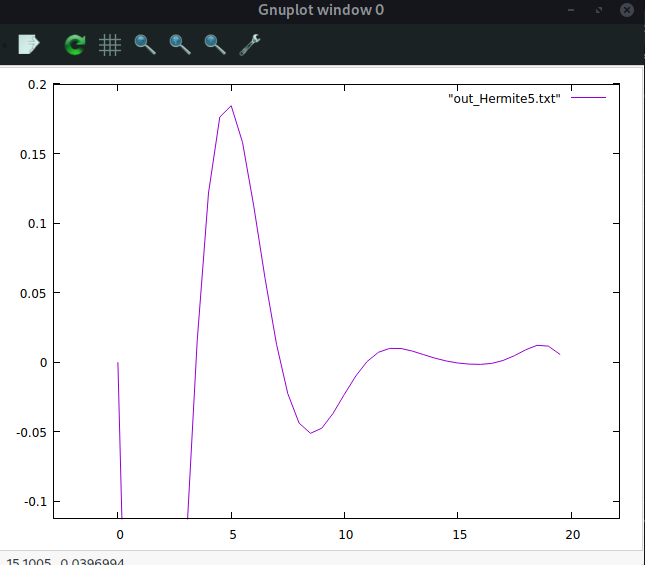

## zad2

Funkcja testowa: $f(x) = \sin(\frac{kx}{\pi})e^\frac{-mx}{\pi}$

a) Przedstaw na wykresie jej dokładny przebieg.


### b) Przedstaw na wykresie jej przebieg dla różnej liczby węzłów

#### 2


#### 3


#### 5


#### 20


### c)

### Implementajca metody Newtona:

```cpp

std::vector<struct point> calc_func_Newton(std::vector<struct point> points, double step){

    std::vector<std::vector<double>> diffs = Newton_diff_calc(points);
    std::vector<struct point> result;
    for(double i = points[0].x; i < points[points.size()-1].x; i += step){
        struct point pt;
        pt.x = i;
        pt.y = Newton(diffs, points, i);
                    std::cout << "x: " << pt.x << " y: " << pt.y << std::endl;
        result.push_back(pt);
    }

    return result;

}

```

```cpp


double Newton(std::vector<std::vector<double>> diff_matrix, std::vector<struct point> points, double x){

    double sum = diff_matrix[0][0]; 
    double u = (x - points[0].x) / (points[1].x - points[0].x); 
    for (int i = 1; i < diff_matrix.size(); i++) { 
        sum = sum + (uCoefNewton(u, i) * diff_matrix[0][i]) / fact(i); 
    }  

    return sum;
}

```

```cpp


std::vector<std::vector<double>> Newton_diff_calc(std::vector<struct point> points){
    
    std::vector<std::vector<double>> diff_matrix(points.size());
    for(int i = 0; i < points.size(); i++){
        diff_matrix[i].resize(points.size());
        diff_matrix[i][0] = points[i].y;
    }
    for (int i = 1; i < points.size(); i++) { 
        for (int j = 0; j < points.size() - i; j++) 
            diff_matrix[j][i] = diff_matrix[j + 1][i - 1] - diff_matrix[j][i - 1]; 
    } 
    return diff_matrix;   
}

```

```cpp


double uCoefNewton(double u, int n) 
{ 
    double temp = u; 
    for (int i = 1; i < n; i++) 
        temp = temp * (u - i); 
    return temp; 
} 

int fact(int n) 
{ 
    int f = 1; 
    for (int i = 2; i <= n; i++) 
        f *= i; 
    return f; 
}

```

## Implementacja metody Lagrange'a:

```cpp

std::vector<struct point> calc_func_Lagrange(std::vector<struct point> points, double step){

    std::vector<struct point> result;
    for(double i = points[0].x; i < points[points.size()-1].x; i += step){
        struct point pt;
        pt.x = i;
        pt.y = Lagrange(points, i);
        result.push_back(pt);
    }

    return result;

}


```

```cpp


double Lagrange(std::vector<point> points, int x) 
{ 
    double result = 0;
  
    for (int i=0; i<points.size(); i++) 
    { 
 
        double term = points[i].y; 
        for (int j=0;j<points.size();j++) 
        { 
            if (j!=i) 
                term = term*(x - points[j].x)/double(points[i].x - points[j].x); 
        } 

        result += term; 
    } 
  
    return result; 
} 

```
## Implementacja metody Hermite'a

```cpp

std::vector<struct point> calc_func_Hermite(std::vector<struct point> points, double step){
    std::vector<struct point> hermite_prep = Hermite_prep(points);
    std::vector<std::vector<double>> diffs = Hermite_diff_calc(hermite_prep);
    std::vector<struct point> result;
    for(double i = points[0].x; i < points[points.size()-1].x; i += step){
        struct point pt;
        pt.x = i;
        pt.y = Hermite(diffs, hermite_prep, i);
        std::cout << "x: " << pt.x << " y: " << pt.y << std::endl;
        result.push_back(pt);
    }

    return result;

}

```

```cpp


double Hermite(std::vector<std::vector<double>> y, std::vector<struct point> x, double value) 
{ 
    float sum = y[0][0]; 
  
    for (int i = 1; i < y.size(); i++) { 
      sum = sum + (proterm(i, value, x) * y[0][i]); 
    } 
    return sum; 
} 

```

```cpp


std::vector<struct point> Hermite_prep(std::vector<struct point> points){
    // std::vector<std::vector<double>> temp;
    std::vector<double> z;
    std::vector<struct point> pts;
    z.resize(points.size()*2);
    pts.resize(points.size()*2);
    for(int i = 0; i < points.size(); i++){
        z[i*2] = z[i*2+1] = points[i].x;
    }

    for(int i = 0; i < z.size(); i++){
        pts[i].x = z[i];
        pts[i].y = func1(z[i]);
    }

    return pts;
}

```

```cpp

std::vector<std::vector<double>> Hermite_diff_calc(std::vector<struct point> points){
    
    std::vector<std::vector<double>> diff_matrix(points.size());
    for(int i = 0; i < points.size(); i++){
        diff_matrix[i].resize(points.size());
        diff_matrix[i][0] = points[i].y;
    }

    for (int i = 1; i <  points.size(); i++) { 
        for (int j = 0; j <  points.size() - i; j++) { 
            if(points[i+j].x == points[j].x){
                diff_matrix[j][i] = func1prim(points[j].x);
            }else{
            diff_matrix[j][i] = (diff_matrix[j][i - 1] - diff_matrix[j + 1][i - 1]) / (points[j].x - points[i + j].x); 
            }
        } 
    } 

    return diff_matrix;   
}

```

```cpp

double proterm(int i, double value, std::vector<struct point> x) 
{ 
    double pro = 1; 
    for (int j = 0; j < i; j++) { 
        pro = pro * (value - x[j].x); 
    } 
    return pro; 
} 

```

```cpp
double func1prim(double x){
    double h = 0.001;
    return (func1(x) - func1(x+h)) / h;
}


```

#### Generowanie punktów metodą Czebyszewa:

```cpp

double cheby_point(double k, double n, double a, double b){
    k += 1;
    double val = 0.5*(a+b) + 0.5*(b-a)*cos(((2*k-1)*M_PI)/(2*n));
    return val;
}

```


 ## Porównanie wyników interpolacji:

Metoda Newtona, punkty równodległe:


Metoda Newtona, punkty generowane metodą Czebyszewa:


Metoda Lagrange'a, punkty równodległe:


Metoda Lagrange'a, punkty generowane metodą Czebyszewa:


Metoda Hermite'a, punkty równodległe:



Metoda Hermite'a, punkty generowane metodą Czebyszewa:


### d)

 * Dla metody Newtona wielomian ze stopniem 5 najlepiej przybliża funkcje.

 * Dla metody Lagrange'a wielomian ze stopniem 20 najlepiej przybliża funkcje.

 * Dla metody Hermite'a wielomian ze stopniem 3 najlepiej przybliża funkcje.


### e)

Efekt Runge'go jest widoczny przy wielomianie ze stopniem 20


