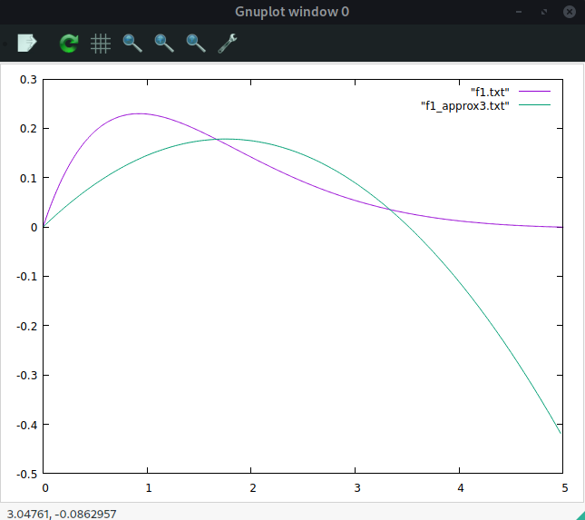
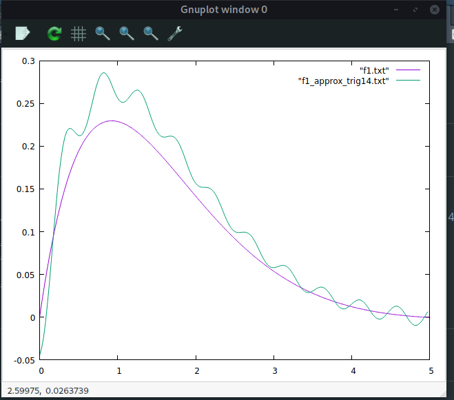
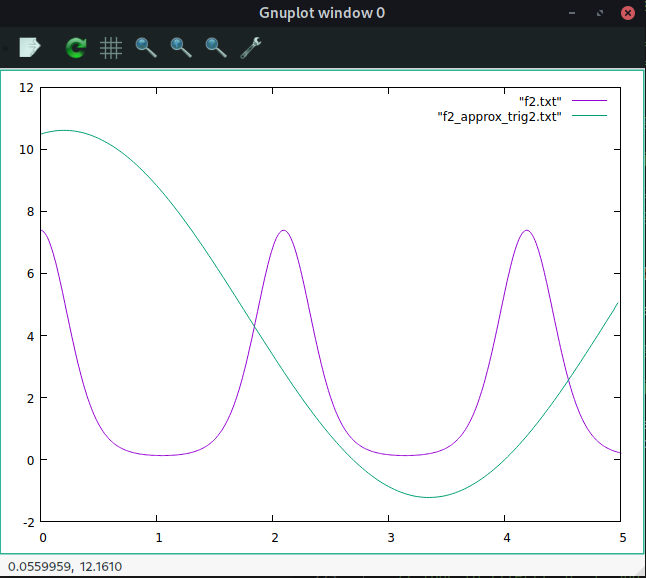

## zad2
### Aproksymacja średniokwadratowa
    

Wybrana funkcja: $f(x) = \sin(\frac{kx}{\pi})e^\frac{-mx}{\pi}$
$k = 2, m=3$

Wykres dokładny:

{width=400px}

#### 2 punkty dyskretyzacji:

{width=400px}

```
Aproksymacja funkcji f1, liczba punktów dyskretyzacji: 2 błąd średni: 0.114989 maksymalny błąd: 0.197741
```
#  
#  

#### 3 punkty dyskretyzacji:

{width=400px}

```
Aproksymacja funkcji f1, liczba punktów dyskretyzacji: 3 błąd średni: 0.0940721 maksymalny błąd: 0.417698
```
#  
#  
#### 4 punkty dyskretyzacji:

{width=400px}

```
Aproksymacja funkcji f1, liczba punktów dyskretyzacji: 4 błąd średni: 0.0482154 maksymalny błąd: 0.377189
```
#  
#  
#### 5 punktów dyskretyzacji:

{width=400px}

```
Aproksymacja funkcji f1, liczba punktów dyskretyzacji: 5 błąd średni: 0.0166266 maksymalny błąd: 0.192854
```
#  
#  
#### 6 punktów dyskretyzacji:

{width=400px}

```
Aproksymacja funkcji f1, liczba punktów dyskretyzacji: 6 błąd średni: 0.00381943 maksymalny błąd: 0.0600003
```
#  
#  
#### 7 punktów dyskretyzacji:

{width=400px}

```
Aproksymacja funkcji f1, liczba punktów dyskretyzacji: 7 błąd średni: 0.000462972 maksymalny błąd: 0.00952596
```
#  
#  
#### 8 punktów dyskretyzacji:

{width=400px}

```
Aproksymacja funkcji f1, liczba punktów dyskretyzacji: 8 błąd średni: 4.16887e-05 maksymalny błąd: 0.000799302
```
#  
#  
#### 9 punków dyskretyzacji:

{width=400px}


```
Aproksymacja funkcji f1, liczba punktów dyskretyzacji: 9 błąd średni: 1.98832e-06 maksymalny błąd: 1.53134e-05

```

--- 

#### Funkcja druga

Wybrana funkcja: $f(x) = e^{kcos(mx)}$
$k = 2, m=3$

Wykres dokładny:

{width=400px}

#### 2 punkty dyskretyzacji:

{width=400px}

```
Aproksymacja funkcji f2, liczba punktów dyskretyzacji: 2 błąd średni: 3.29294 maksymalny błąd: 9.04485
```
#  
#  

#### 4 punkty dyskretyzacji:

{width=400px}

```
Aproksymacja funkcji f2, liczba punktów dyskretyzacji: 4 błąd średni: 3.11305 maksymalny błąd: 11.765
```
#  
#  
#### 6 punktów dyskretyzacji:

{width=400px}

```
Aproksymacja funkcji f2, liczba punktów dyskretyzacji: 6 błąd średni: 4.08478 maksymalny błąd: 46.375
```
#  
#  
#### 12 punktów dyskretyzacji:

{width=400px}

```
Aproksymacja funkcji f2, liczba punktów dyskretyzacji: 12 błąd średni: 7.94333 maksymalny błąd: 314.531
```
#  
#  
#### 18 punktów dyskretyzacji:

{width=400px}

```
Aproksymacja funkcji f2, liczba punktów dyskretyzacji: 18 błąd średni: 0.6101 maksymalny błąd: 6.15589
```
#  
#  
#### 22 punktów dyskretyzacji:

{width=400px}

```
Aproksymacja funkcji f2, liczba punktów dyskretyzacji: 22 błąd średni: 0.442243 maksymalny błąd: 5.58223
```
#  
#  
#### 26 punktów dyskretyzacji:

{width=400px}

```
Aproksymacja funkcji f2, liczba punktów dyskretyzacji: 26 błąd średni: 3.09564 maksymalny błąd: 224.175
```
---

### Kod:
```cpp
double approx_func(double x, int n){
    return pow(x, (double) n);
}
```
```cpp
arr2d create_A(arr2d &points, double(*appr)(double x, int n)){
    
    arr2d res;
    int n = points.size();
    res.resize(n);

    for(int i = 0; i < n; i++){

        res[i].resize(n);

        for(int j = 0; j < n; j++){

            double sum = 0;
            for(int s = 0; s < n; s++) sum += appr(points[s][0], i+j);

            res[i][j] = sum;

        }

    }
    return res;
}

```
```cpp
std::vector<double> create_B(arr2d &points, double(*appr)(double x, int n)){
    std::vector<double> res;
    
    int n = points.size();
    res.resize(n);

    for(int i = 0; i < n; i++){

        double sum = 0;
        for(int s = 0; s < n; s++) sum += points[s][1]*appr(points[s][0], i);
        res[i] = sum;

    }

    return res;

}
```
```cpp
arr2d generatePoints(double (*f)(double x), double a, double b, double n){

    arr2d res;
    double step = my_abs(b-a)/n;


    int it = 0;
    for(double i = a; i < b; i +=step){
        std::vector<double> a;
        a.resize(2);
        a[0] = i;
        a[1] = f(i);
        res.push_back(a);
        it++;
    }
    return res;
}
```
```cpp
arr2d generatePoints2(std::vector<double> &A, double a, double b, double n){

    arr2d res;
    double step = my_abs(b-a)/n;


    int it = 0;
    for(double i = a; i < b; i +=step){
        std::vector<double> a;
        a.resize(2);
        a[0] = i;
        a[1] = result_func(A, approx_func, i);
        res.push_back(a);
        it++;
    }
    return res;
}
```
```cpp
double result_func(std::vector<double> A, double (*appr)(double x, int n), double x){
    double sum = 0;
    for(int i = 0; i < (int) A.size(); i++){
        sum += A[i]*appr(x,i);
    }
    return sum;
}
```
```cpp
std::vector<double> solve_coeff(arr2d &points){

    
    arr2d A = create_A(points, approx_func);
    std::vector<double> B = create_B(points, approx_func);

    std::vector<int> P(A.size()+1,0);
    std::vector<double> X(A.size(),0);
    
    LUPDecompose(A,A.size(), 1.0e-7, P);

    LUPSolve(A, P, B, A.size(), X);
    return X;
}
```

## zad3
### Aproksymacja trygonometryczna

Wybrana funkcja: $f(x) = \sin(\frac{kx}{\pi})e^\frac{-mx}{\pi}$
$k = 2, m=3$

Wykres dokładny:

{width=400px}


#### 2 punkty dyskretyzacji:

{width=400px}

```
Aproksymacja funkcji f1, liczba punktów dyskretyzacji: 2 błąd średni: 0.0760033 maksymalny błąd: 0.195846
```
#  
#  

#### 6 punktów dyskretyzacji:

{width=400px}

```
Aproksymacja funkcji f1, liczba punktów dyskretyzacji: 6 błąd średni: 0.0396225 maksymalny błąd: 0.12827
```
#  
#  


#### 10 punktów dyskretyzacji:

{width=400px}

```
Aproksymacja funkcji f1, liczba punktów dyskretyzacji: 10 błąd średni: 0.0307814 maksymalny błąd: 0.0974175
```
#  
#  


#### 14 punktów dyskretyzacji:

{width=400px}

```
Aproksymacja funkcji f1, liczba punktów dyskretyzacji: 14 błąd średni: 0.0199011 maksymalny błąd: 0.0605348
```
#  
#  


#### 26 punktów dyskretyzacji:

{width=400px}

```
Aproksymacja funkcji f1, liczba punktów dyskretyzacji: 26 błąd średni: 0.0258343 maksymalny błąd: 0.0651713
```
---  
### Funkcja druga

Wybrana funkcja: $f(x) = e^{kcos(mx)}$
$k = 2, m=3$

Wykres dokładny:

{width=400px}


#### 2 punkty dyskretyzacji:

{width=400px}

```
Aproksymacja funkcji f2, liczba punktów dyskretyzacji: 2 błąd średni: 4.16383 maksymalny błąd: 9.54877
```


#### 6 punktów dyskretyzacji:

{width=400px}

```
Aproksymacja funkcji f2, liczba punktów dyskretyzacji: 6 błąd średni: 3.44804 maksymalny błąd: 7.57764
```


#### 10 punktów dyskretyzacji:

{width=400px}

```
Aproksymacja funkcji f2, liczba punktów dyskretyzacji: 10 błąd średni: 1.58131 maksymalny błąd: 6.00488
```


#### 18 punktów dyskretyzacji:

{width=400px}

```
Aproksymacja funkcji f2, liczba punktów dyskretyzacji: 18 błąd średni: 1.2471 maksymalny błąd: 4.96366
```


#### 22 punktów dyskretyzacji:

{width=400px}

```
Aproksymacja funkcji f2, liczba punktów dyskretyzacji: 22 błąd średni: 0.751188 maksymalny błąd: 4.34071
```


#### 26 punktów dyskretyzacji:

{width=400px}

```
Aproksymacja funkcji f2, liczba punktów dyskretyzacji: 26 błąd średni: 0.836302 maksymalny błąd: 4.96471
```

### kod:
```cpp
double a_coef( int n, arr2d &points){
    double sum = 0;
    for(int i = 0; i < points.size(); i++){
        sum += points[i][1]*cos(points[i][0]*n);
    }
    return sum/points.size()*2;
}
```
```cpp
double b_coef( int n, arr2d &points){
    double sum = 0;
    for(int i = 0; i < points.size(); i++){
        sum += points[i][1]*sin(points[i][0]*n);
    }
    return sum/points.size()*2;
}
```
```cpp
double result_func_trigo(double x, int n, arr2d &points){
    double sum = 0.5*a_coef(0,points);
    for(int i = 1; i < n; i++){
        sum += (a_coef(i, points)*cos(i*x) + b_coef(i,points)*sin(i*x));
    }
    return sum;
}
```
```cpp
arr2d generatePoints3(arr2d &points, double a, double b, double n, int approx_lvl){

    arr2d res;
    double step = my_abs(b-a)/n;


    int it = 0;
    for(double i = a; i < b; i +=step){
        std::vector<double> a;
        a.resize(2);
        a[0] = i;
        a[1] = result_func_trigo(i, approx_lvl, points);
        res.push_back(a);
        it++;
    }
    return res;
}
```
